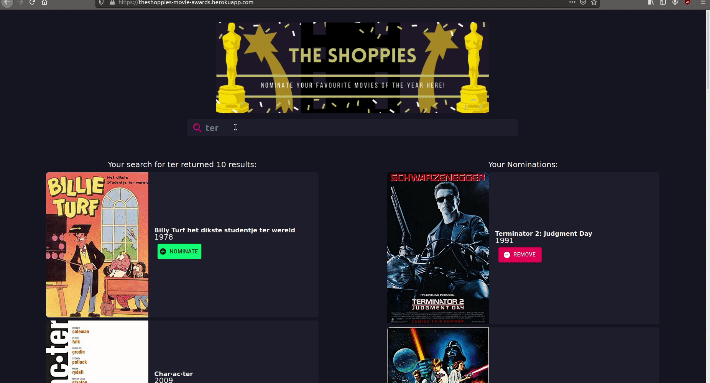
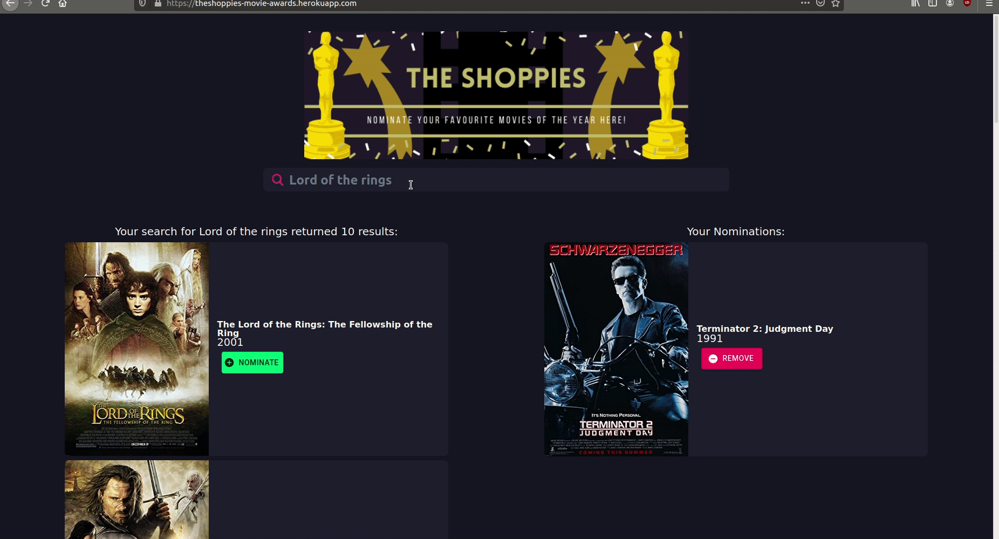
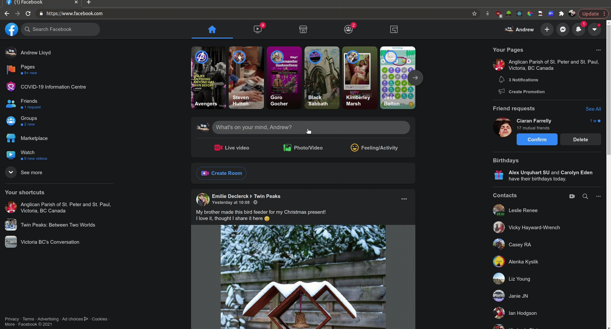
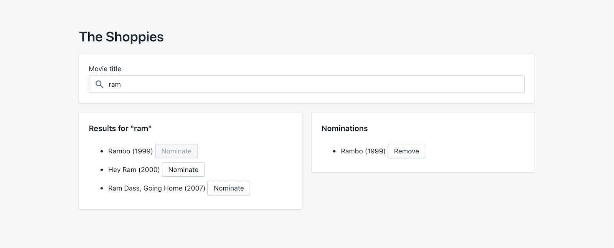

# UX Developer Intern & Web Developer Intern Challenge - Summer 2021 - The Shoppies

## The Shoppies is deployed on Heroku

Try out the live version of the app at https://theshoppies-movie-awards.herokuapp.com/ You may need to wait for a few moments or refresh for the app to fully load as Heroku puts the server to sleep after inactivity.

## Table of Contents

- [Getting Started](##Getting-Started)
- [Screenshots](#Screenshots)
- [Stretch Features Added](#Stretch-Features-Added)
- [Future Improvements and updates](#Future-Improvements-and-updates)
- [Dependencies](#dependencies)
- [The Challenge](#The-Challenge)
  - [Technical Requirements](##Technical-requirements)
  - [Extras](#Extras)
- [User Stories](#User-Stories)
- [Project Dependencies](#Project-Dependencies)
  - [Backend](#Backend)
  - [Frontend](#Frontend)
- [Contact](#Contact)

## Getting Started

Prerequisites
This setup expects Git, Ruby v3.0.0, Rails v6.1 and Postgres to be installed.

1. Fork and clone the project
2. cd to the shoppies-backend directory and run `bundle install`
3. The project uses Postgres you may need to configure the `database.yml` file in shoppies-backend/config to suit your Postgres credentials.
4. Run the following commands to set up the db setup your db: `rake db:drop db:create db:migrate`
5. cd to the shoppies-frontend directory and run `npm install`
6. Make a .env file in the root of the shoppies-frontend directory for the OMDB key, see the .env.example file as an example.
7. in the shoppies-backend directory run the the following:

`foreman start -p 3000`

The application will then start up on localhost:3000

This line: `"proxy": "http://localhost:3001/",` in package.json on the front end is needed to re-direct requests to the API locally but should be removed on deployment.

# Screenshots

# Stretch Features Added:

- Save nomination lists if the user leaves the page
- Spinner Animation to show status of search
- Create shareable links
- Default cover art added for entries that return N/A for movie poster
- Display total number of users who have nominated 5 films
- OpenGraph cards when sharing links with image and description.
   

# Future Improvements and Updates:

- Add different search filters to the search bar e.g. search by type, year
- Add unit testing and integration testing with Jest and Cypress
- Add media queries for mobile responsive layouts
- Add nomination envelope placeholders when the user has nominations still to make
- Cache movie search results in database for faster and more relevant searches/implement pagination for results.
   
   

# The Challenge:

## The Shoppies: Movie awards for entrepreneurs

<b>Shopify has branched out into movie award shows and we need your help. Please build us an app to help manage our movie nominations for the upcoming Shoppies.</b>
  

We need a webpage that can search OMDB for movies, and allow the user to save their favourite films they feel should be up for nomination. When they've selected 5 nominees they should be notified they're finished.

We'd like a simple to use interface that makes it easy to:

- Search OMDB and display the results (movies only)
  Add a movie from the search results to our nomination list
- View the list of films already nominated
- Remove a nominee from the nomination list

## Technical requirements

- Search results should come from OMDB's API (free API key: http://www.omdbapi.com/apikey.aspx).
- Each search result should list at least its title, year of release and a button to nominate that film.
- Updates to the search terms should update the result list
- Movies in search results can be added and removed from the nomination list.
- If a search result has already been nominated, disable its nominate button.
  Display a banner when the user has 5 nominations.

# User Stories

- As a user I should be able to nominate a film.
- As a user I should be able to un-nominate a film.
- As a user I should be able to search for films to nominate
- As a user I should be able to see a list of the films I have nominated
- As a user I should not be able to nominate the same film twice
- Users must be able to see at least a title, year of release and a nominate button.
- As a user I should be able to nominate a film if it is a remake or reboot and has a different year of release but the same title as a prior release
- Users should have the ability to share a link with their nominations in
- Users nominations should be remembered when they return to the page
- As a user I should see a banner when I nominate 5 films
- As a user I should not see a banner if I have nominated 5 films and remove one

## Extras

There is a lot to be improved on here, you can polish the required features by crafting a nicer design, or improve the app by adding new features! Choose something that you feel best showcases your passion and skills.

If you need inspiration, here are examples of what you can work on. If you work on these ideas, we recommend choosing only one or two.

- Save nomination lists if the user leaves the page
- Animations for loading, adding/deleting movies, notifications
- Create shareable links

# Project Dependencies

## Backend

    ruby 3.0.0
    rails ~> 6.0
    pg
    puma ~> 3.11
    foreman
    rest-client
    faker
    rails_same_site_cookie
    bootsnap >= 1.1.0
    rack-cors
    byebug
    listen >= 3.0.5 < 3.2
    spring
    spring-watcher-listen ~> 2.0.0

## Frontend

    @material-ui/core: ^4.11.2
    @material-ui/icons: ^4.11.2
    @testing-library/jest-dom: ^5.11.4
    @testing-library/react: ^11.1.0
    @testing-library/user-event: ^12.1.10
    axios: ^0.21.0
    classnames: ^2.2.6
    dotenv: ^8.2.0
    react: ^17.0.1
    react-dom: ^17.0.1
    react-scripts: 4.0.0
    react-uuid: ^1.0.2
    web-vitals: ^0.2.4

# Contact

Questions? Comments? Please get in touch via email andrew.lloyd01@googlemail.com or connect with me on [Linkedin](https://www.linkedin.com/in/andrewlloyd01/)

README: Last updated January 17, 2021
